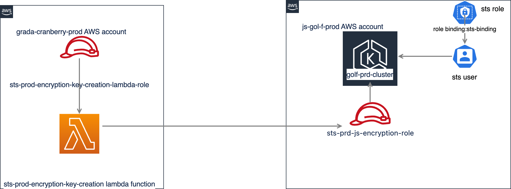
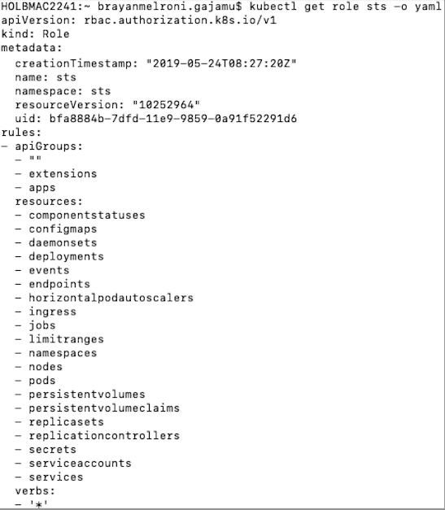
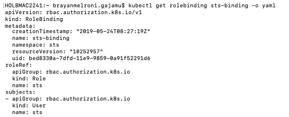
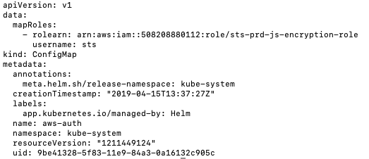

# Restarting Pods With Encryption Key Creation

This document aims to present how sts-prod-encryption-key-creation
lambda function gets permission to restart pods created by
sts-js-avro-encryption-processor deployment. The same applies to all
other environments.

The setup involves following resources. 

-   [Role sts in golf-prd-cluster(EKS) in js-gol-f-prod AWS
    account](#RestartingPodsWithEncryptionKeyCreation)

-   [Role Binding object: sts-binding in golf-prd-cluster (EKS) in
    js-gol-f-prod AWS account](#RestartingPodsWithEncryptionKeyCreation)

-   [IAM role: sts-prd-js-encryption-role in js-gol-f-prod AWS
    account](#RestartingPodsWithEncryptionKeyCreation)

-   [IAM role: sts-prod-encryption-key-creation-lambda-role in
    grada-cranberry-prod AWS
    account](#RestartingPodsWithEncryptionKeyCreation)

-   [Lambda function: sts-prod-encryption-key-creation in
    grada-cranberry-prod AWS
    account](#RestartingPodsWithEncryptionKeyCreation)

## Role sts in golf-prd-cluster(EKS) in js-gol-f-prod AWS account

A role in EKS contains rules that represent a set of permissions.  A
rule specifies the actions it allows performing on different resources
in the cluster. Existing sts role allows performing any action on
deployments in sts namespace. 

## Role Binding object: sts-binding in golf-prd-cluster (EKS) in js-gol-f-prod AWS account

A Role Binding object in an EKS cluster links a role with a user. sts
role in EKS cluster is bound to a user called sts via an existing role
binding object called sts-binding.  

That means the sts user can perform all actions defined in sts role. So
that sts user can perform any action on a deployment. 

## IAM role: sts-prd-js-encryption-role in js-gol-f-prod AWS account

This is the IAM role for service account named
sts:sts-prd-js-encryption-service-account. It was decided to do
following changes to the role. 

-   sts user in EKS cluster was mapped to this IAM role via updating
    aws-auth config map in the kube-system namespace.  

           Command used to update the mapping : kubectl edit  configmap
aws-auth -n kube-system

           Updated aws-auth config map looks like below. 

            

           After updating above configmap,
\'sts-prd-js-encryption-role\' IAM role inherits all the permissions
from sts user. That means this role can now perform any action on a
deployment in the EKS cluster.   

           Reference:
<https://docs.aws.amazon.com/eks/latest/userguide/add-user-role.html> 

-   Following statement was added to the policy attached to the role, so
    that this role gets permission to get descriptive information about
    the EKS cluster.  

           {\
            \"Action\": \[\
                \"eks:DescribeCluster\"\
            \],\
            \"Effect\": \"Allow\",\
            \"Resource\":
\"arn:aws:eks:eu-west-1:508208880112:cluster/golf-prd-cluster\"\
         }

         Reference :
<https://docs.aws.amazon.com/eks/latest/APIReference/API_DescribeCluster.html>

-   The IAM role attached to the lambda function in grada-cranberry-prod
    AWS account was added as a trusted entity for this role, so that it
    can assume this role. Exact statement added is mentioned below. 

          {\
            \"Sid\": \"\",\
            \"Effect\": \"Allow\",\
            \"Principal\": {\
                \"AWS\":
\"arn:aws:iam::903716715040:role/sts-prod-encryption-key-creation-lambda-role\"\
            },\
            \"Action\": \"sts:AssumeRole\"\
        }

## IAM role: sts-prod-encryption-key-creation-lambda-role in grada-cranberry-prod AWS account

This is the IAM role for sts-prod-encryption-key-creation lambda
function. Following policy was attached to this role, so that it can
assume sts-prd-js-encryption-role in js-gol-f-prod AWS account. 

{\
    \"Statement\": \[\
        {\
            \"Action\": \[\
                \"sts:AssumeRole\"\
            \],\
            \"Effect\": \"Allow\",\
            \"Resource\":
\"arn:aws:iam::508208880112:role/sts-prd-js-encryption-role\"\
        }\
    \],\
    \"Version\": \"2012-10-17\"\
}

After setting all above, sts-prod-encryption-key-creation-lambda-role
inherits following permissions.

-   It can  perform any action on a deployment in the EKS cluster. 

-   It can describe EKS cluster, so that it can retrieve EKS API server
    endpoint and certificate authority data to access the cluster.

## Lambda function: sts-prod-encryption-key-creation in grada-cranberry-prod AWS account

-   A lambda layer containing boto3, datetime,
    kubernetes\[<https://github.com/kubernetes-client/python>\] python
    packages were added to the function.  

-   Python code to assume the  sts-prd-js-encryption-role, connect to
    the EKS cluster and restart the pods was added. 

Updated python code file can be found at
<https://github.com/JSainsburyPLC/grada-cranberry-infrastructure/blob/prod/terraform/modules/encryption/lambda_python_scripts/create_new_encryption_keys.py>
